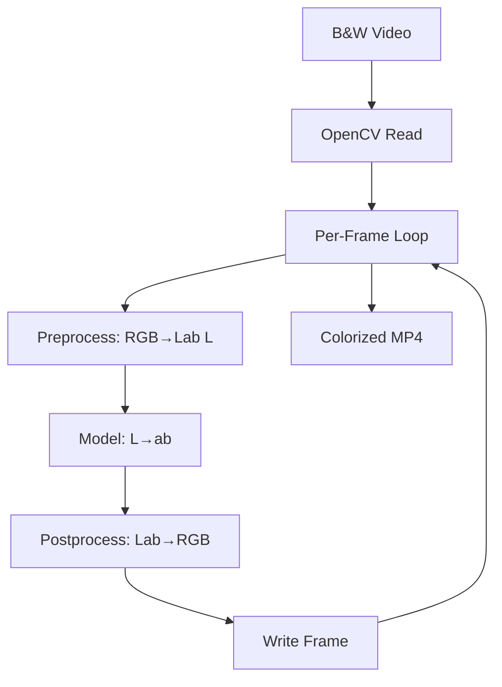
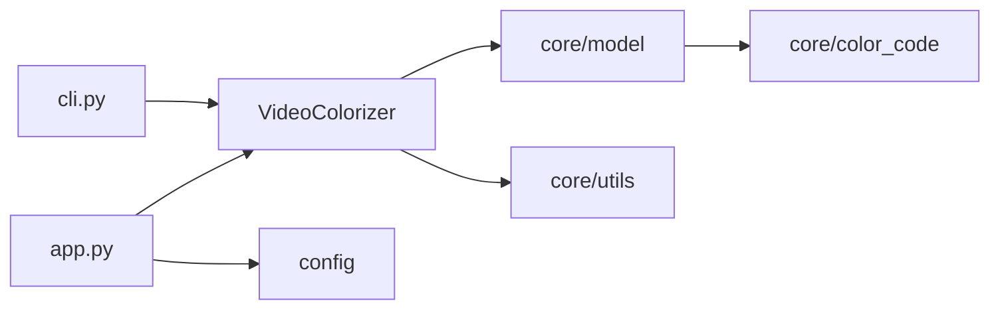

# Architecture Documentation

Production architecture for the Black & White Video Colorization pipeline.

---

## System Overview

```
┌─────────────────────────────────────────────────────────────────────────────┐
│                         USER / CLIENT                                        │
│  (Browser, CLI, API)                                                        │
└─────────────────────────────────────────────────────────────────────────────┘
                                    │
                                    ▼
┌─────────────────────────────────────────────────────────────────────────────┐
│                      PRESENTATION LAYER                                      │
│  ┌──────────────┐  ┌──────────────┐  ┌──────────────┐                      │
│  │ Gradio Web UI │  │    CLI       │  │   (Future)    │                      │
│  │   app.py      │  │   cli.py     │  │  FastAPI      │                      │
│  └──────────────┘  └──────────────┘  └──────────────┘                      │
└─────────────────────────────────────────────────────────────────────────────┘
                                    │
                                    ▼
┌─────────────────────────────────────────────────────────────────────────────┐
│                      PIPELINE LAYER                                          │
│  ┌──────────────────────────────────────────────────────────────────────┐   │
│  │ VideoColorizer (pipeline/colorizer.py)                                │   │
│  │  • Video I/O (OpenCV)    • Frame loop    • Error handling             │   │
│  └──────────────────────────────────────────────────────────────────────┘   │
└─────────────────────────────────────────────────────────────────────────────┘
                                    │
                                    ▼
┌─────────────────────────────────────────────────────────────────────────────┐
│                      CORE LAYER                                              │
│  ┌─────────────┐  ┌─────────────┐  ┌─────────────┐  ┌─────────────┐         │
│  │  model.py   │  │  utils.py   │  │color_code.py│  │  config.py  │         │
│  │  (RCNN)     │  │ preprocessing│  │ Lab norm    │  │  settings   │         │
│  └─────────────┘  └─────────────┘  └─────────────┘  └─────────────┘         │
└─────────────────────────────────────────────────────────────────────────────┘
                                    │
                                    ▼
┌─────────────────────────────────────────────────────────────────────────────┐
│                      EXTERNAL                                                │
│  • Pretrained weights (S3)    • PyTorch CUDA    • File system              │
└─────────────────────────────────────────────────────────────────────────────┘
```

---

## Pipeline Data Flow

```
INPUT VIDEO (B&W)
       │
       ▼
┌──────────────────┐
│  cv2.VideoCapture │
└────────┬─────────┘
         │ frame (BGR / Grayscale)
         ▼
┌──────────────────┐     ┌──────────────────┐
│  BGR → RGB        │────▶│  rgb2lab()       │
│  Grayscale → RGB  │     │  (skimage)       │
└──────────────────┘     └────────┬─────────┘
                                   │ L channel
                                   ▼
┌──────────────────┐     ┌──────────────────┐
│  Resize 256×256   │────▶│  RCNN Model      │
│  (PIL/skimage)    │     │  L → ab prediction│
└──────────────────┘     └────────┬─────────┘
                                  │ ab channels
                                  ▼
┌──────────────────┐     ┌──────────────────┐
│  lab2rgb()       │◀────│  Concat L + ab    │
│  + clip to [0,1] │     │  Interpolate      │
└────────┬─────────┘     └──────────────────┘
         │
         ▼
┌──────────────────┐     ┌──────────────────┐
│  RGB → BGR       │────▶│  cv2.VideoWriter  │
│  scale 0-255      │     │  MP4 output       │
└──────────────────┘     └──────────────────┘
```

---

## RCNN Model Architecture (Zhang et al.)

```
Input: L channel (1×256×256)

  Conv1   → 64ch   stride 2   → 128×128
  Conv2   → 128ch  stride 2   → 64×64
  Conv3   → 256ch  stride 2   → 32×32
  Conv4   → 512ch  stride 2   → 16×16
  Conv5-6 → 512ch  dilated 2 → 16×16
  Conv7   → 512ch  stride 1  → 16×16
  Conv8   → 256ch  upsample 2 → 32×32
  Conv    → 313 classes (quantized ab)
  Softmax + 1×1 Conv → 2 channels (ab)
  Upsample 4× → 256×256 ab

Output: ab channels (2×H×W)
```

---

## Deployment Topology

### Hugging Face Spaces

```
┌────────────────────────────────────────────────────────┐
│  Hugging Face Space (santu24/black-and-white-colorization-2)  │
│                                                         │
│  ┌─────────────┐    ┌─────────────┐    ┌─────────────┐  │
│  │ Gradio UI   │───▶│  app.py     │───▶│  Pipeline   │  │
│  │ (iframe)    │    │  (Python)   │    │  + Model    │  │
│  └─────────────┘    └─────────────┘    └─────────────┘  │
│         │                    │                  │        │
│         └────────────────────┴──────────────────┘        │
│                            │                             │
│                    CPU inference (default)               │
└────────────────────────────────────────────────────────┘
```

### Docker / Self-Hosted

```
┌────────────────────────────────────────────────────────┐
│  Docker Container / Host                                │
│                                                         │
│  Port 7860 ──▶ Gradio ──▶ Pipeline ──▶ Model            │
│                                                         │
│  Volumes:  ./data  (optional persistence)               │
│  Env:      USE_GPU=true for CUDA                         │
└────────────────────────────────────────────────────────┘
```

---

## Mermaid Diagrams (for GitHub/HF render)

### End-to-End Flow



### Component Dependencies


