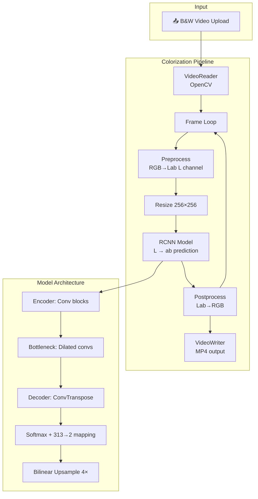
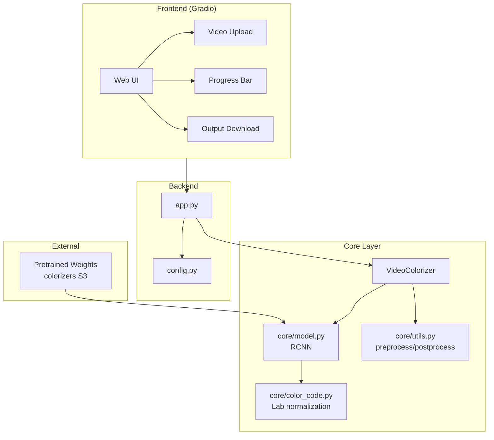

# 🎬 Black & White Video Colorization

> **Production-grade AI pipeline** to transform classic black & white footage into vivid color using deep learning. Deployable on Hugging Face Spaces, Docker, or self-hosted.

[](https://huggingface.co/spaces/santu24/black-and-white-colorization-2)
[](https://ieeexplore.ieee.org/abstract/document/10134476/)

---

## 🚀 Live Demo

**[→ Try the Colorization Tool](https://huggingface.co/spaces/santu24/black-and-white-colorization-2)**

Upload your B&W video directly in the browser — no installation required.

---

## 📋 Table of Contents

- [Features](#-features)
- [Tech Stack & Tools](#-tech-stack--tools)
- [Architecture](#-architecture)
- [Sample Videos](#-sample-videos)
- [Quick Start](#-quick-start)
- [Deployment](#-deployment)
- [Configuration](#-configuration)
- [Project Structure](#-project-structure)
- [Paper & Attribution](#-paper--attribution)

---

## ✨ Features

| Feature | Description |
|---------|-------------|
| **Frame-by-frame colorization** | Zhang et al. E2E CNN architecture |
| **Lab color space** | Realistic chrominance prediction (ab channels) |
| **GPU acceleration** | CUDA support when available |
| **Error resilience** | Continues on frame failures |
| **Multi-format** | MP4, AVI, MOV, MKV, WebM |

---

## 🛠 Tech Stack & Tools

### Core ML & Inference
| Tool | Version | Purpose |
|------|---------|---------|
| **PyTorch** | ≥2.0 | Deep learning framework |
| **TorchVision** | ≥0.15 | Model utilities |
| **scikit-image** | ≥0.21 | Lab ↔ RGB color space conversion |
| **NumPy** | ≥1.24 | Numerical operations |

### Video & Image Processing
| Tool | Version | Purpose |
|------|---------|---------|
| **OpenCV** (opencv-python-headless) | ≥4.8 | Video I/O, frame decode/encode |
| **Pillow** | ≥10.0 | Image resize, format handling |

### Web & Deployment
| Tool | Version | Purpose |
|------|---------|---------|
| **Gradio** | ≥4.0 | Web UI, Hugging Face Spaces |
| **Docker** | latest | Containerized deployment |

### Development & Ops
| Tool | Purpose |
|------|---------|
| **Python** | 3.9+ runtime |
| **tqdm** | Progress visualization |
| **logging** | Structured logging |

> 📐 Full architecture details: [ARCHITECTURE.md](ARCHITECTURE.md)

---

## 🏗 Architecture

### High-Level Flow



### Data Flow (Per Frame)

```mermaid
flowchart LR
    subgraph Input["Input Frame"]
        A1[BGR/Grayscale]
    end

    subgraph Preprocess
        A1 --> B1[Convert to RGB]
        B1 --> C1[rgb2lab]
        C1 --> D1[Extract L channel]
        D1 --> E1[Resize to 256×256]
    end

    subgraph Model["RCNN Inference"]
        E1 --> F1[Normalize L]
        F1 --> G1[Conv1-4: Encoder]
        G2[Dilated Conv 5-7]
        G1 --> G2
        G2 --> H1[ConvTranspose: Decoder]
        H1 --> I1[313-class Softmax]
        I1 --> J1[1×1 Conv → 2 channels]
        J1 --> K1[Upsample 4×]
    end

    subgraph Postprocess
        K1 --> L1[Interpolate to orig size]
        L1 --> M1[Concat L + ab]
        M1 --> N1[lab2rgb]
        N1 --> O1[BGR 0-255]
    end

    O1 --> P1[Output Frame]
```



### Component Diagram



### How It Works (Step-by-Step)

1. **Upload** — User uploads a B&W video (MP4, AVI, MOV, MKV, WebM).
2. **Decode** — OpenCV reads frames; BGR/grayscale → RGB.
3. **Preprocess** — Convert to Lab, extract L (luminance), resize to 256×256 for inference.
4. **Inference** — RCNN predicts ab (chrominance) from L using pretrained weights.
5. **Postprocess** — Combine L + ab, convert Lab → RGB, resize to original resolution.
6. **Encode** — Write colorized frames to MP4 via OpenCV VideoWriter.
7. **Download** — User downloads the colorized video.

---

## 🎥 Sample Videos

Use any black & white video to test the pipeline. Here are some sources for sample B&W footage:

### Free Sample Sources

| Source | Link | Notes |
|--------|------|-------|
| **Pexels** | [pexels.com/search/black and white video](https://www.pexels.com/search/videos/black%20and%20white/) | Free stock B&W clips |
| **Pixabay** | [pixabay.com/videos/search/black white](https://pixabay.com/videos/search/black%20white/) | Free for commercial use |
| **Internet Archive** | [archive.org/details/movies](https://archive.org/details/movies) | Classic public domain films |

### Suggested Test Clips

- **Short clips (5–30 sec)** work best for quick testing.
- **Resolution**: 720p or 480p recommended for faster processing.
- **Format**: MP4 with H.264 is most compatible.

### Using Your Own

Place sample videos in `data/input/` when running locally, or upload directly in the [Hugging Face app](https://huggingface.co/spaces/santu24/black-and-white-colorization-2).

---

## 🚀 Quick Start

### Option 1: Hugging Face (No Install)

**[→ Open the app](https://huggingface.co/spaces/santu24/black-and-white-colorization-2)** and upload a video.

### Option 2: Local Run

```bash
cd final_deployment
pip install -r requirements.txt
python app.py
```

Open **http://localhost:7860**

### Option 3: CLI (Headless)

```bash
python cli.py --input path/to/video.mp4 --output colorized.mp4
```

### Option 4: Docker

```bash
docker build -t bw-colorizer .
docker run -p 7860:7860 bw-colorizer
```

---

## 📦 Deployment

### Hugging Face Spaces

1. Create a Space at [huggingface.co/spaces](https://huggingface.co/spaces)
2. Choose **Gradio** SDK
3. Upload the `final_deployment` contents
4. Set `app.py` as the main script

**Live Space:** [santu24/black-and-white-colorization-2](https://huggingface.co/spaces/santu24/black-and-white-colorization-2)

---

## ⚙️ Configuration

| Variable | Default | Description |
|----------|---------|--------------|
| `USE_GPU` | `false` | Enable CUDA if available |
| `API_HOST` | `0.0.0.0` | Bind address |
| `API_PORT` | `7860` | Server port |
| `MAX_VIDEO_FRAMES` | `10000` | Max frames per video |
| `MAX_UPLOAD_MB` | `500` | Max upload size (MB) |

---

## 📁 Project Structure

```
final_deployment/
├── app.py                 # Gradio application (entry point)
├── cli.py                 # Command-line interface
├── config.py              # Configuration & env vars
├── requirements.txt
├── README.md
├── Dockerfile
├── core/
│   ├── __init__.py
│   ├── model.py           # RCNN colorization model
│   ├── color_code.py      # Lab space normalization
│   └── utils.py           # Pre/post processing
├── pipeline/
│   ├── __init__.py
│   └── colorizer.py       # Video processing pipeline
└── data/
    ├── input/             # Sample input videos
    └── output/            # Colorized outputs
```

---

## 📜 Paper & Attribution

- **Our Paper**: [IEEE Xplore](https://ieeexplore.ieee.org/abstract/document/10134476/)
- **Model weights**: [richzhang/colorization](https://github.com/richzhang/colorization) (Zhang et al.)
- **Architecture**: E2E colorization, Lab color space

---

## 🔗 Links

| Resource | URL |
|----------|-----|
| **Live App** | [Hugging Face Space](https://huggingface.co/spaces/santu24/black-and-white-colorization-2) |
| **Paper** | [IEEE Xplore](https://ieeexplore.ieee.org/abstract/document/10134476/) |
| **Original Model** | [GitHub - richzhang/colorization](https://github.com/richzhang/colorization) |
